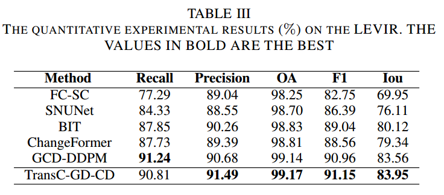
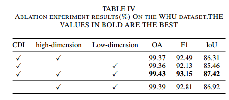

# T-GDCD-Transformer-Based-Generative-Diffusion-Change-Detection-Model-for-Remote-Sensing

### `[Paper](https://www.google.com)`
### `[Code](https://www.google.com)`

#### Yihan Wen，Qi Cao and Guanchong Niu
####  The Hong Kong Polytechnice University，Xidian University
## Network Architecture

##  ## Quantitative & Qualitative Results on LEVIR and WHU


##  Usage
### Requirements
```pytorch```
