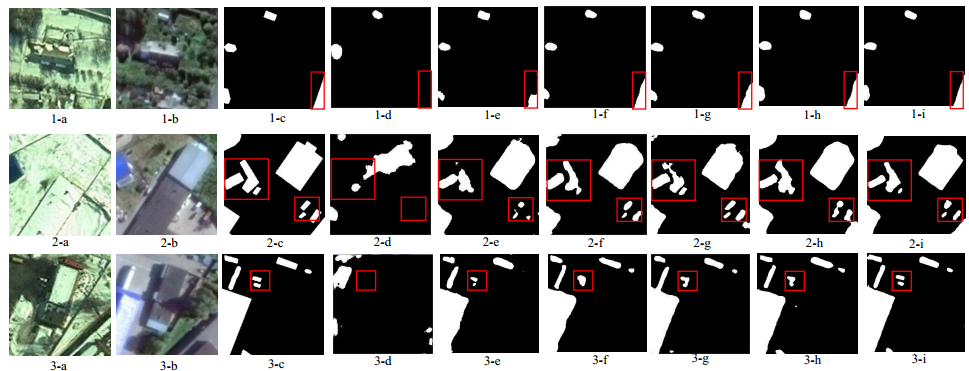

# T-GDCD-Transformer-Based-Generative-Diffusion-Change-Detection-Model-for-Remote-Sensing

### [Paper](https://www.google.com) 'https://www.google.com'
### [Code](https://github.com/LiuFxxx/T-GDCD) 'https://github.com/LiuFxxx/T-GDCD'
## Network Architecture

## Quantitative & Qualitative Results on CDD and WHU


##  Usage
### Requirements
```
Python 3.8.0
pytorch 1.10.1
torchvision 0.11.2
einops  0.3.2
```
Please see ```requirements.txt``` for all the other requirements.
### Installation
Clone this repo:
```
git clone https://github.com/LiuFxxx/T-GDCD.git
```
### Setting up conda environment:
Create a virtual ```conda``` environment named ```GDCD``` with the following command:
```
conda create --name GDCD --file requirements.txt
conda activate GDCD
```

